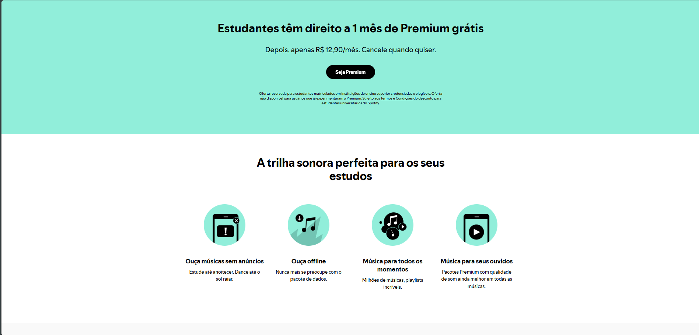

# Projeto — Site Spotify Student

## Integrantes

* João Pedro Lantelme | 1139790
* Laura Portella de Souza | 1139306

## Site referência

https://www.spotify.com/br-pt/student/

---

## Checklist

### 1.1 Estrutura HTML semântica e acessível

* [ ] Utilização de tags semânticas como `header`, `nav`, `main`, `section` e `footer`.
* [ ] Todas as imagens possuem `alt` descritivo.
* [ ] Formulário funcional com `label` associado aos campos.

### 1.2 Fidelidade visual

* [ ] Cores, espaçamentos, proporções e tipografia semelhantes ao site de referência.
* [ ] Organização do cabeçalho, conteúdo e rodapé baseada no site original.
* [ ] Pequenas diferenças foram adaptadas conforme as necessidades do projeto.

### 1.3 CSS

* [ ] Utilização de diferentes seletores: classes, descendentes e pseudo-classes.
* [ ] Utilização do Box Model com `margin`, `padding`, `border` e dimensões.
* [ ] Utilização de variáveis CSS para cores e outros valores.

### 1.4 Responsividade

* [ ] CSS desenvolvido com abordagem Mobile First.
* [ ] Utilização de Flexbox/Grid para organização dos elementos.
* [ ] Media query com `min-width` para telas maiores.
* [ ] Página testada em dispositivos móveis e desktop.

### 1.5 Personalização

* [ ] Adição de elementos próprios que não existem no site original.
* [ ] Rodapé personalizado com informações do projeto/desenvolvedor.

---

## Padrão de commits

Cada commit deve indicar **claramente o que foi adicionado ou alterado** e **qual parte do site está sendo construída ou modificada**.

O nome do commit deve seguir o formato:

```text
tipo: ação realizada — parte do site
```

### Tipos de commit

* `feat`: adição de uma nova funcionalidade ou elemento.
* `style`: alteração visual, como cores, espaçamentos, fontes ou layout.
* `fix`: correção de um problema.
* `refactor`: reorganização ou melhoria do código sem alterar o resultado visual/funcional.

### Exemplos

```text
feat: adiciona estrutura do cabeçalho — header
```

```text
style: ajusta cores e espaçamentos — cabeçalho
```

```text
feat: adiciona formulário de inscrição — seção de formulário
```

```text
style: cria layout responsivo — conteúdo principal
```

```text
feat: adiciona informações dos desenvolvedores — rodapé
```

```text
fix: corrige associação dos labels — formulário
```

```text
style: ajusta tipografia e proporções — seção principal
```

### Regra

O commit **não deve utilizar mensagens genéricas**, como:

```text
alterações
```

```text
mudanças no site
```

```text
update
```

```text
correções
```

A mensagem deve permitir identificar rapidamente **o que foi feito** e **em qual parte do site**.

---

## Site original


