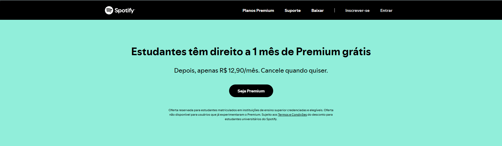
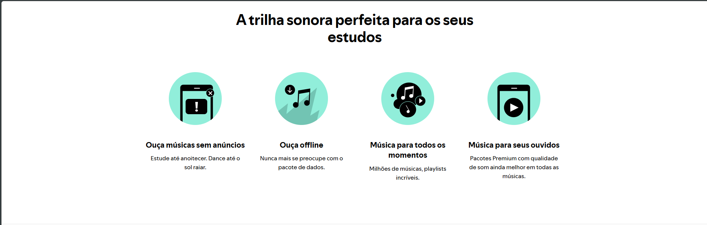
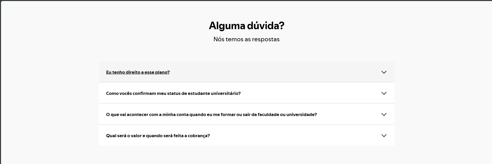
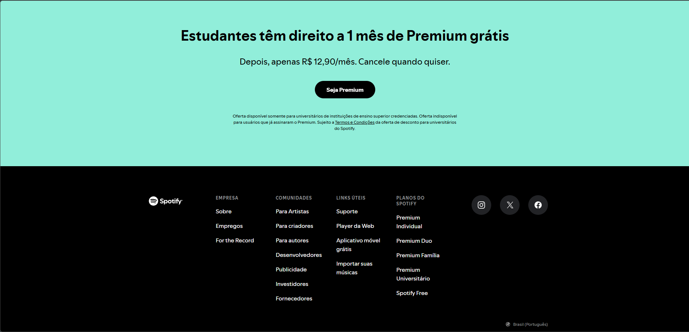
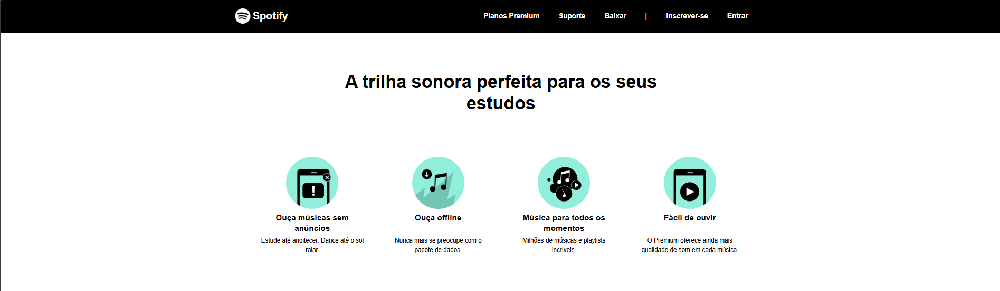
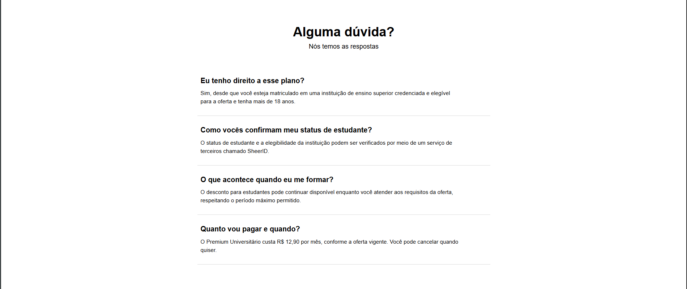
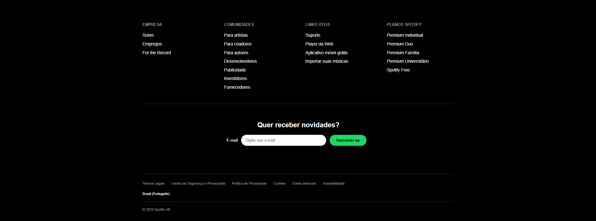

# Projeto — Site Spotify Universitário

## Integrantes

* **João Pedro Lantelme** | Matrícula: 1139790
* **Laura Portella de Souza** | Matrícula: 1139306

## Site de referência

[Spotify Premium para Estudantes](https://www.spotify.com/br-pt/student/)

---

# Referência escolhida

A referência escolhida foi a página **Spotify Premium para Estudantes**.

Escolhemos essa página por apresentar um layout moderno, organizado e visualmente simples de reproduzir. A página possui diferentes seções, como apresentação, benefícios, perguntas frequentes e rodapé, permitindo aplicar os conhecimentos de **HTML semântico, CSS, Flexbox, Grid e responsividade** estudados na disciplina.

---

# Parte 1 — Página HTML e CSS

## 1.1 Estrutura HTML semântica e acessível

### Checklist

* [x] Utilização de `header`
* [x] Utilização de `nav`
* [x] Utilização de `main`
* [x] Utilização de `section`
* [x] Utilização de `article`
* [x] Utilização de `footer`
* [x] Imagens com atributo `alt` descritivo
* [x] Formulário funcional
* [x] `label` associado aos campos do formulário
* [x] Campo de e-mail utilizando `type="email"`

### Justificativa

A estrutura HTML foi organizada utilizando elementos semânticos para representar as diferentes partes da página. O `header` foi utilizado para o cabeçalho e a navegação, o `main` para o conteúdo principal, as `section` para dividir os blocos da página, os `article` para representar conteúdos individuais e o `footer` para o rodapé.

O formulário foi estruturado com `label` associado ao campo por meio dos atributos `for` e `id`. O campo de e-mail utiliza `type="email"` para permitir a validação do endereço informado.

---
### Análise da página original

A página original do Spotify Premium para Estudantes apresenta uma estrutura organizada em diferentes áreas de conteúdo.

* **`header`**: apresenta a identificação visual do Spotify e a área de navegação da página.

* **`nav`**: organiza os elementos utilizados para a navegação e acesso às áreas do Spotify.

* **`main`**: reúne o conteúdo principal da página, incluindo a oferta do Premium Universitário, os benefícios e as perguntas frequentes.

* **`section`**: divide o conteúdo em diferentes blocos, como a apresentação da oferta, os benefícios e as perguntas frequentes.

* **`article`**: organiza conteúdos individuais, como os benefícios e as perguntas frequentes, em blocos independentes.

* **`footer`**: apresenta links institucionais, comunidades, links úteis, planos do Spotify, informações legais e a opção de idioma e país.

* **Imagens**: os elementos visuais utilizados complementam a apresentação do conteúdo e ajudam na identificação da página.

* **Formulário e interação**: a página apresenta a oferta para estudantes e direciona o usuário para o processo de verificação de elegibilidade. A presença de interação com o usuário serviu como referência para a criação das funcionalidades do projeto.

A análise dessa estrutura foi utilizada como base para desenvolver a página do projeto, mantendo a organização geral da referência e adaptando os elementos para a implementação acadêmica.

---

## 1.2 Fidelidade visual à referência

### Checklist

* [x] Cabeçalho semelhante ao site original
* [x] Cores semelhantes à referência
* [x] Tipografia semelhante
* [x] Espaçamentos semelhantes
* [x] Chamada principal em destaque
* [x] Seção de benefícios
* [x] Área de perguntas frequentes
* [x] Botões semelhantes à referência
* [x] Rodapé organizado de forma semelhante
* [x] Organização geral semelhante à página original

### Justificativa

A página foi desenvolvida observando a organização visual do site de referência, sem copiar o código-fonte original.

Foram utilizados como base elementos visuais presentes na página do Spotify, como o cabeçalho, a chamada principal, os benefícios, as perguntas frequentes, os botões e a organização do rodapé.

Foram feitas pequenas adaptações para adequar o conteúdo e a implementação às necessidades do projeto.

---

## Comparação visual

### Site original









### Site desenvolvido








---

# 1.3 CSS: seletores, box model e variáveis

### Checklist

* [x] Seletores por classe
* [x] Seletores descendentes
* [x] Pseudo-classes
* [x] `:hover`
* [x] `:focus-visible`
* [x] Box Model
* [x] `margin`
* [x] `padding`
* [x] `border`
* [x] `width`
* [x] `height`
* [x] Variáveis CSS
* [x] Unidades relativas e absolutas

### Justificativa

Foram utilizadas classes para organizar e estilizar os componentes da página. Também foram utilizados seletores descendentes para aplicar estilos em elementos dentro de determinadas partes do site.

Pseudo-classes como `:hover` e `:focus-visible` foram utilizadas para representar diferentes estados de interação dos elementos.

O Box Model foi aplicado por meio de propriedades como `margin`, `padding`, `border`, `width` e `height`.

As principais cores reutilizadas foram organizadas por meio de variáveis CSS dentro de `:root`, facilitando a manutenção e a organização do código.

---

# 1.4 Responsividade: Flexbox, Grid e Mobile First

### Checklist

* [x] Desenvolvimento utilizando Mobile First
* [x] Flexbox
* [x] CSS Grid
* [x] Media query com `min-width`
* [x] Layout adaptado para celular
* [x] Layout adaptado para desktop
* [x] Teste em diferentes tamanhos de tela

### Justificativa

O desenvolvimento do CSS foi realizado utilizando a abordagem **Mobile First**, começando pela organização dos elementos para telas menores.

O **Flexbox** foi utilizado para organizar elementos como o cabeçalho, a navegação, o formulário e os benefícios em diferentes situações de layout.

O **CSS Grid** foi utilizado principalmente na organização da estrutura dos benefícios e do rodapé.

Para telas maiores, foi utilizada uma media query com `min-width`, permitindo reorganizar e distribuir melhor os elementos no desktop.

---

# 1.5 Personalização e originalidade

### Checklist

* [x] Adição de elemento próprio que não existe no site original
* [x] Personalização de algum componente da página

### Justificativa

Foi adicionado um **timer de estudos de 25 minutos** na seção principal da página.

O usuário pode iniciar, pausar e reiniciar o timer para organizar uma sessão de estudos. A funcionalidade foi desenvolvida com JavaScript e integrada ao layout da página como uma personalização própria do projeto, relacionada ao público estudantil.

---

# Parte 2 — Processo e Git

## Histórico de desenvolvimento

O desenvolvimento do projeto foi registrado utilizando Git, com commits realizados durante as diferentes etapas da construção da página.

### Checklist

* [x] Pelo menos 8 commits
* [x] Commits realizados em pelo menos 3 dias diferentes
* [x] Commits descrevendo as alterações realizadas
* [x] `index.html` na raiz do repositório
* [x] `style.css` na raiz do repositório
* [x] `README.md` na raiz do repositório
* [x] `script.js` na raiz do repositório

---

## Estrutura do projeto

```text
ProjetoSpotifyStudent/

│
├── index.html
├── style.css
├── script.js
├── README.md
│
└── img/
    ├── logo-spotify.webp
    ├── sem-anuncio.png
    ├── ouca-offline.png
    ├── musica-todos-momentos.png
    ├── qualidade-musica.png
    ├── SiteOriginal1.png
    ├── SiteOriginal2.png
    ├── SiteOriginal3.png
    ├── SiteOriginal4.png
    ├── siteDesenvolvido1.png
    ├── siteDesenvolvido2.png
    ├── siteDesenvolvido3.png
    └── siteDesenvolvido4.png
```

---

# Site original

A página utilizada como referência pode ser acessada pelo link:

[Spotify Premium para Estudantes](https://www.spotify.com/br-pt/student/)

---

# Observação

Este projeto é uma reprodução acadêmica da página **Spotify Premium para Estudantes**, utilizada como referência para o desenvolvimento do site.

O projeto foi desenvolvido do zero utilizando HTML, CSS e JavaScript, buscando reproduzir a estrutura e os principais elementos visuais da página de referência, além de incluir uma personalização própria por meio do timer de estudos.
